# Talcon

Kubernetes runtime security doesn't stop at "we got an alert." Talcon is a small stack I put together that goes from **mTLS-verified identity → zero-trust networking → kernel-level enforcement → MITRE-mapped detection → automatic pod quarantine → Slack alert**, with Grafana and Hubble showing every step of it happening.

No SOAR platform, no third-party SaaS. Just Cilium, Tetragon, Falco, SPIRE, and about 250 lines of Python gluing the response together.

## Why I built this

Most "runtime security" demos stop at showing you an alert in a dashboard. Cool, but now what — someone has to see it, understand it, and go kill the pod manually. By the time that happens, the attacker has had minutes to do damage.

I wanted to see how far I could push "detect and respond automatically" using only open-source, CNCF-adjacent tooling. Talcon is the result: a compromised pod gets network-isolated within a second of the alert firing, no human required — and I recorded every layer of it actually working, not just the happy-path diagram.

## How it works

```
node-to-node traffic
        │
        ▼
SPIRE + Cilium mTLS — every node authenticates with a SPIFFE identity
        │
        ▼
Cilium zero-trust network policy — deny-all by default, kube-proxy replaced entirely
        │
        ▼
attacker execs into a pod
        │
        ▼
Tetragon (eBPF, kernel-level)
  ├─ known-bad syscalls → killed instantly (SIGKILL) or blocked (EPERM)
  └─ everything else     → observed and passed through
        │
        ▼
Falco (custom rules mapped to MITRE ATT&CK) — fires a CRITICAL alert → Falcosidekick
        │
        ▼
IR Controller (Flask, in-cluster)
  ├─ checks the rule against a MITRE-technique allowlist
  ├─ applies a deny-all NetworkPolicy to the pod (quarantine)
  ├─ labels + annotates the pod with the MITRE technique + reason
  ├─ creates a Kubernetes Event for the audit trail
  └─ posts the incident to Slack
        │
        ▼
Hubble + Grafana — every dropped packet and every enforcement event, visualized
```

## The stack

| Component | Role |
|---|---|
| **SPIRE** | Issues SPIFFE identities to nodes; Cilium uses these to require and validate mutual TLS between nodes before traffic is allowed through. |
| **Cilium** | eBPF-based CNI, running as a full kube-proxy replacement. Zero-trust `CiliumNetworkPolicy` rules — deny-all by default, explicit allow-lists for DNS and in-namespace traffic. Also gives us Hubble for flow visibility. |
| **Tetragon** | eBPF-based runtime enforcement. Kills shells the instant they spawn (`sys_execve` → `Sigkill`), blocks reads of `/etc/shadow` and friends (`security_file_open` → `Override`), and observes exec/network activity for everything else. |
| **Falco** | Runtime threat detection. Ships with custom rules that map straight to MITRE ATT&CK technique IDs (T1059.004, T1003.008, T1071, T1105, T1095, T1046, T1552.x...). `rule_matching: all` is turned on so custom CRITICAL rules can't get shadowed by Falco's built-in stock rules. |
| **IR Controller** | A small Flask app (`controller/app.py`) that receives Falco webhooks via Falcosidekick, decides whether the alert is high-confidence enough to act on, and executes the quarantine + audit + Slack workflow — each step runs in its own thread so a slow Slack API call can't delay the actual network isolation. |
| **Prometheus + Grafana** | ServiceMonitors for Falco and Tetragon, plus a `PrometheusRule` that re-labels raw Tetragon policy events with their MITRE technique ID and tactic. |

## Repo layout

```
Talcon/
├── cilium-policies/       # default-deny + explicit allow CiliumNetworkPolicies
├── tetragon-policies/      # TracingPolicies — enforcement (kill/block) + observability
├── falco/                  # Helm values: custom MITRE rules + Falcosidekick routing
├── monitoring/              # ServiceMonitors + MITRE-mapping PrometheusRule
└── controller/              # Flask IR controller (app.py, Dockerfile, RBAC, Deployment)
```

## Screenshots — walking through every layer

### 1. Identity — mTLS between nodes via SPIRE

Before any policy or detection layer even matters, Cilium requires nodes to prove who they are. SPIRE hands out the SPIFFE identities, and the Cilium agent logs show a full handshake — policy requiring authentication, SNI validated, certificate validated, successfully authenticated.

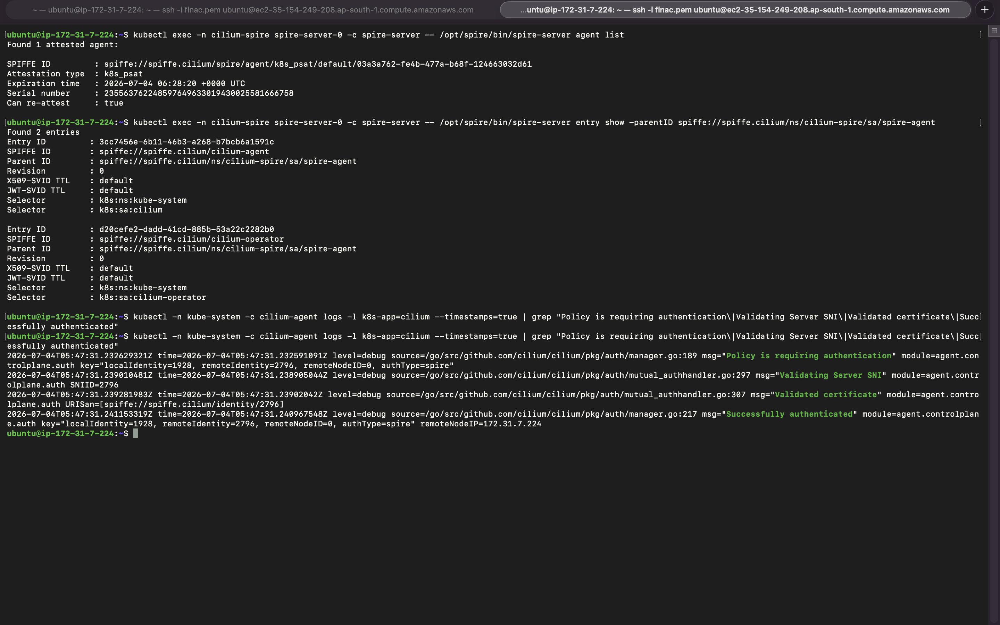

### 2. Networking — Cilium as a full kube-proxy replacement

`cilium status` showing every component healthy, and confirmation straight from the `cilium-config` ConfigMap that `kube-proxy-replacement` is running in `"true"` mode — no kube-proxy in the data path at all.

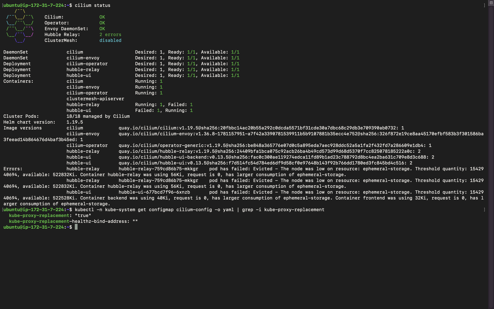

### 3. Enforcement — Tetragon policies actually stopping things

Applying the TracingPolicies and testing them one at a time: a spawned shell gets killed immediately, reading `/etc/passwd` is denied even after the shell-kill policy is removed (the sensitive-file policy catches it independently), and legitimate traffic like a plain `curl` still goes through.

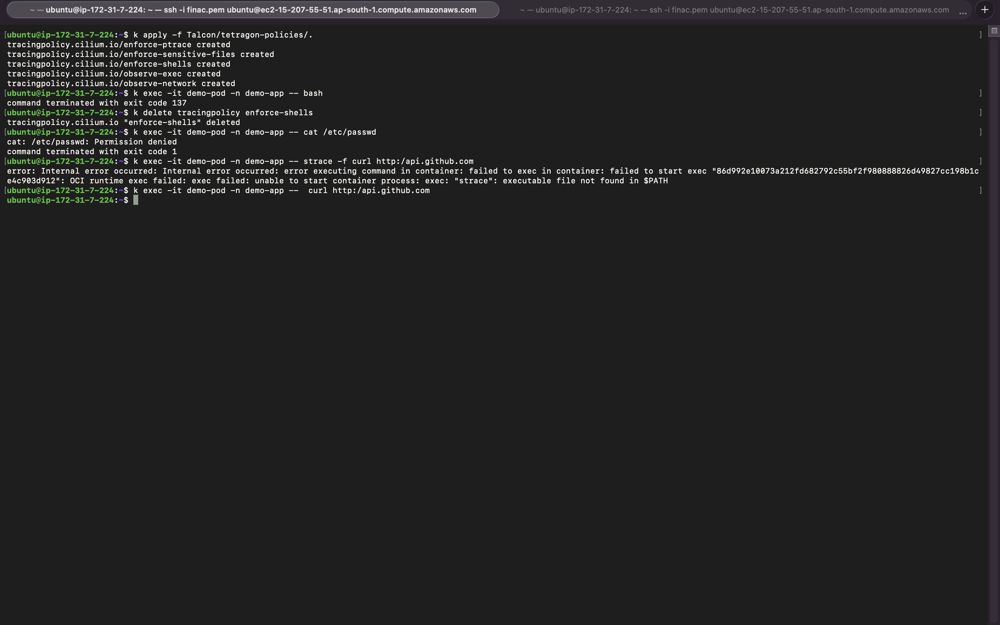

### 4. Enforcement — raw eBPF event stream

`tetra getevents -o compact` showing the actual kernel-level events as they happen — process execs, `security_file_open` calls, syscalls tied to the exact container and PID responsible.

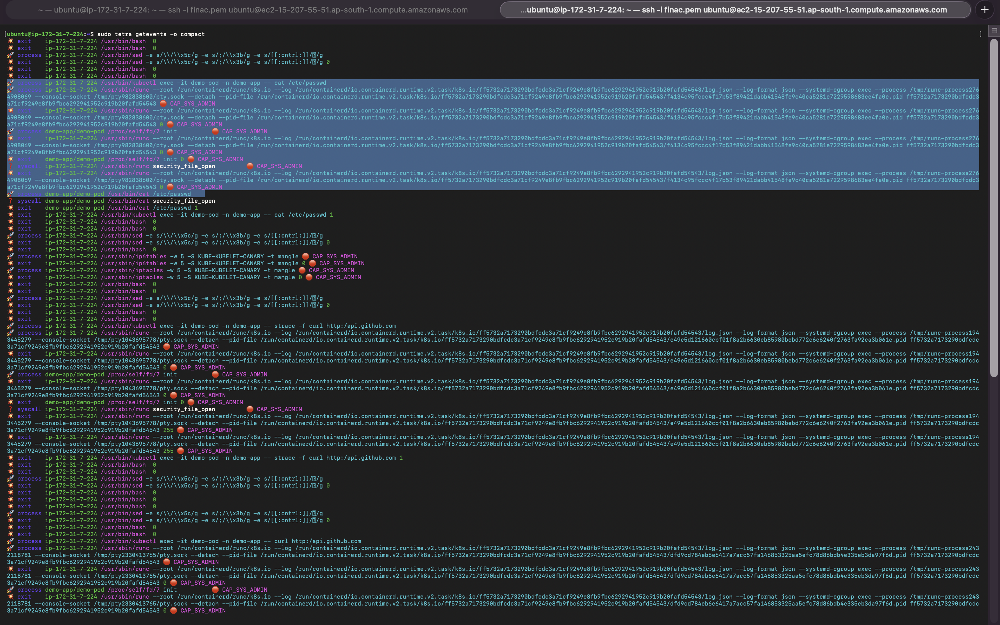

### 5–7. Detection → automatic quarantine, tested three ways

The core loop: exec into a pod, try to act like an attacker, and watch the IR controller auto-quarantine it with a deny-all `NetworkPolicy` — tested against an existing pod, a freshly spawned "compromised" pod, and again in a completely different namespace to confirm it isn't hardcoded to one app.

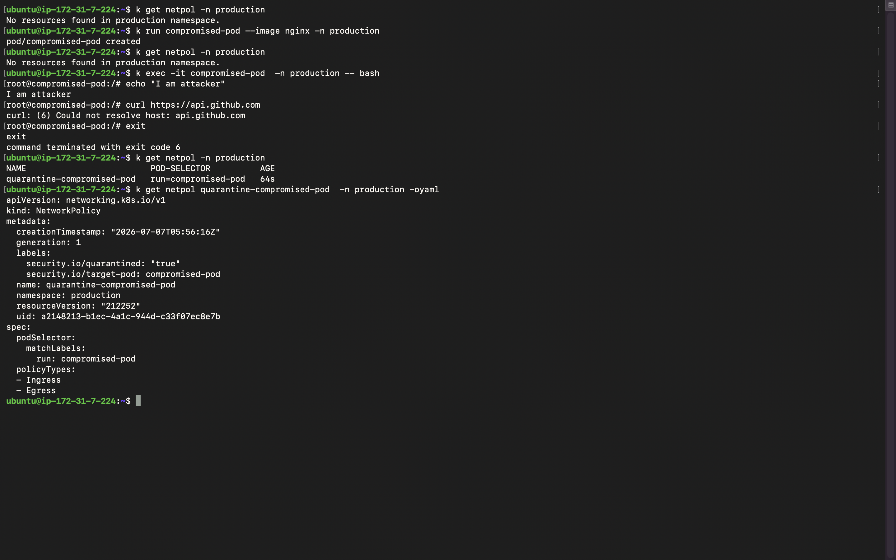

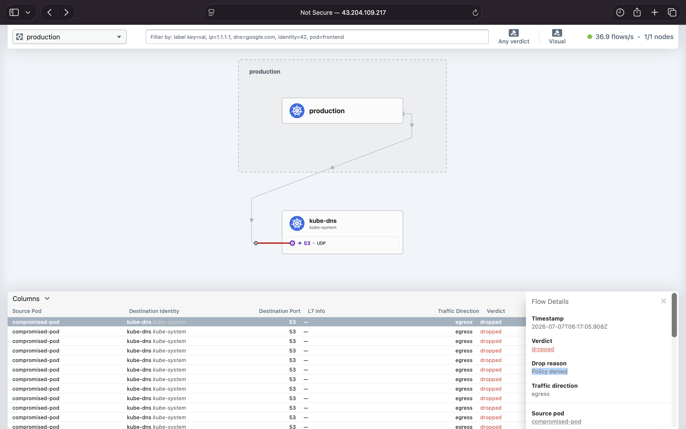


### 8. Detection UI — Falco / Falcosidekick

The Falcosidekick UI, filterable by priority, hostname, rule, and MITRE tag, with a running total of everything Falco has caught.

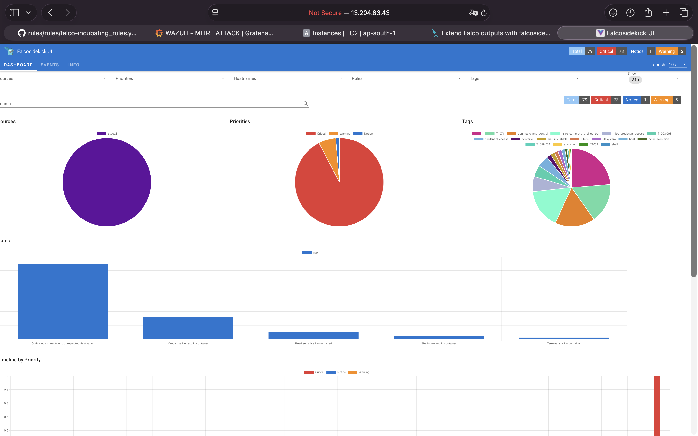

### 9. Alerting — Slack

The same alerts, routed to Slack in real time, MITRE technique ID and all — this is what the on-call person actually sees.

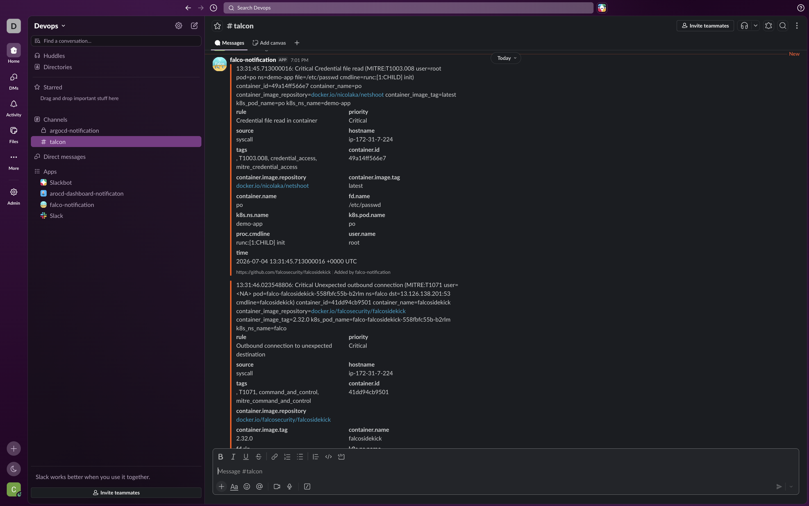

### 10–11. Observability — Grafana, Cilium metrics

Node health, memory, BPF map pressure, and API latency on one board; forwarded traffic, conntrack, and dropped-packet counters (by policy) on the other.

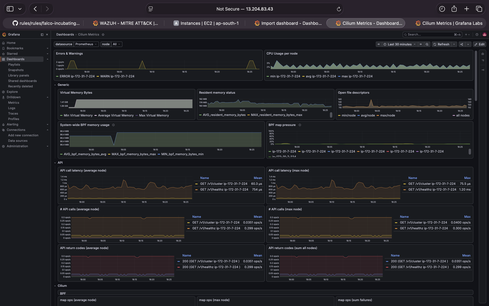

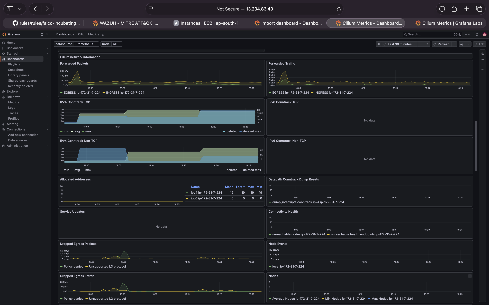

### 12. Observability — Grafana, Tetragon + MITRE

Policy events re-labeled with their MITRE technique, `enforce-shells` SIGKILL events, sensitive-file open attempts, and outbound connection attempts, all on one dashboard.

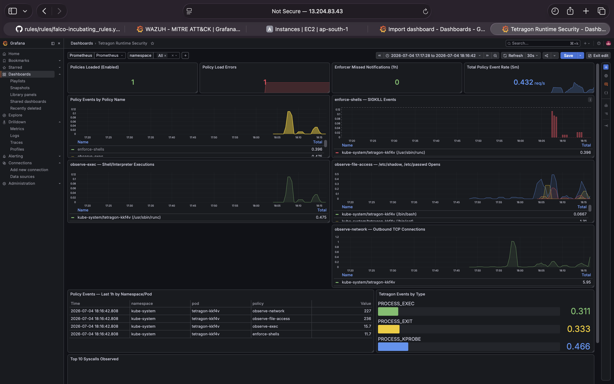

### 13–15. Observability — Hubble service maps

The full picture, straight from the network layer: normal service-to-service traffic in `kube-system`, the security tooling itself talking to Falco and the IR controller, and — the payoff — a quarantined pod's DNS lookup getting dropped with `Policy denied` as the reason, proof the quarantine is actually holding.

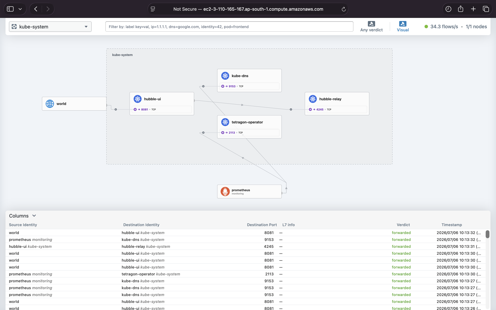

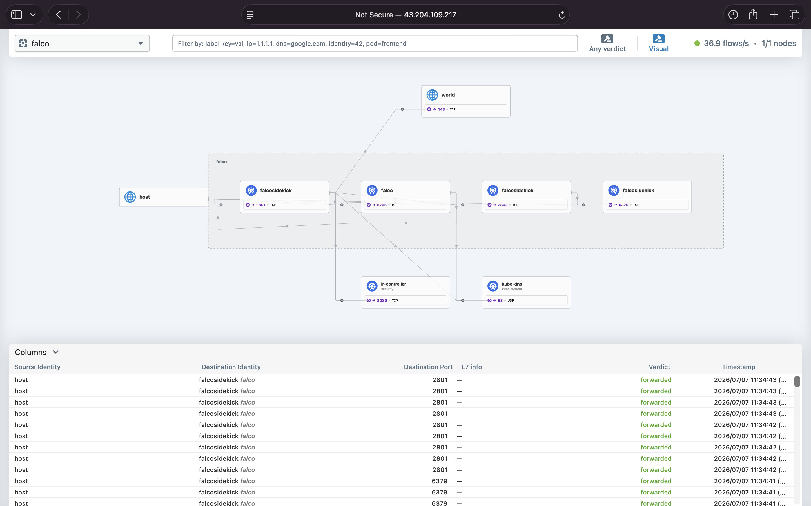


## MITRE ATT&CK coverage

| Technique | Tactic | How it's handled |
|---|---|---|
| T1059.004 | Execution | Tetragon kills the shell on spawn; Falco also detects it if enforcement is off |
| T1003.008 | Credential Access | Tetragon blocks the syscall; Falco flags any read attempt |
| T1611 | Privilege Escalation | Falco detects `ptrace`/`mount` from inside a container |
| T1036 | Defense Evasion | Falco flags binaries run from `/tmp` and base64-decode-to-shell patterns |
| T1071 / T1105 / T1095 | Command and Control | Falco flags unexpected outbound connections, `wget`/`curl`, and reverse-shell patterns |
| T1046 | Discovery | Falco flags recon tools (`nmap`, `masscan`, etc.) |
| T1552.001 / T1552.007 | Credential Access | Falco flags grepping for secrets and reads of the service account token |

The controller only auto-quarantines on a curated subset of these (the ones with a low false-positive rate). Everything else still gets logged, dashboarded, and alerted on — it just doesn't trigger an automatic pod kill.

## Running it yourself

You'll need a cluster with Cilium as the CNI (kube-proxy replacement mode), SPIRE for mTLS, and Helm.

```bash
# 1. Cilium network policies
kubectl apply -f cilium-policies/

# 2. Tetragon enforcement + observability policies
kubectl apply -f tetragon-policies/

# 3. Falco + Falcosidekick (routes alerts to the controller and to Slack)
helm install falco falcosecurity/falco -n falco --create-namespace \
  -f falco/values.yaml \
  --set "falcosidekick.config.slack.webhookurl=YOUR_SLACK_WEBHOOK_URL"

# 4. IR controller
kubectl apply -f controller/rbac.yaml
kubectl apply -f controller/deployment.yaml
kubectl apply -f controller/service.yaml

# 5. Monitoring (assumes kube-prometheus-stack is already installed)
kubectl apply -f monitoring/
```

Then try to break in:

```bash
kubectl run compromised-pod --image nginx -n demo-app
kubectl exec -it compromised-pod -n demo-app -- bash
```

Watch it get killed, watch Falco fire, watch the `NetworkPolicy` show up, watch Slack light up, watch Hubble show the DNS lookups getting dropped afterward.

## A few notes on the design

- **Threads, not a queue.** The controller fires off quarantine, annotation, audit-event, and Slack calls in parallel threads with a short timeout, so a hanging Slack webhook can't delay the actual network isolation. Simple, and good enough at this scale — a real production version would probably want a proper queue.
- **`rule_matching: all` in Falco.** By default Falco stops at the first matching rule per event, which means a broad built-in rule can silently shadow a more specific custom one for the same event. Worth knowing if your custom MITRE rules ever seem to just... not fire.
- **System namespaces are excluded everywhere** (`kube-system`, `falco`, `security`, `monitoring`, etc.) so the security tooling doesn't end up quarantining itself.
- **This is a lab/demo setup, not hardened for production as-is** — the RBAC is broad (cluster-wide pod/networkpolicy/event access) and there's no rate limiting on the webhook. Treat it as a starting point.

## What I'd add next

- A proper unquarantine workflow (right now it's manual)
- Rate limiting / dedup on the webhook so a noisy alert storm can't spam Slack
- Signed container images + admission control, to catch things before they even run

---

If you're digging through the policies or the controller code and something's unclear, open an issue — happy to walk through the reasoning.